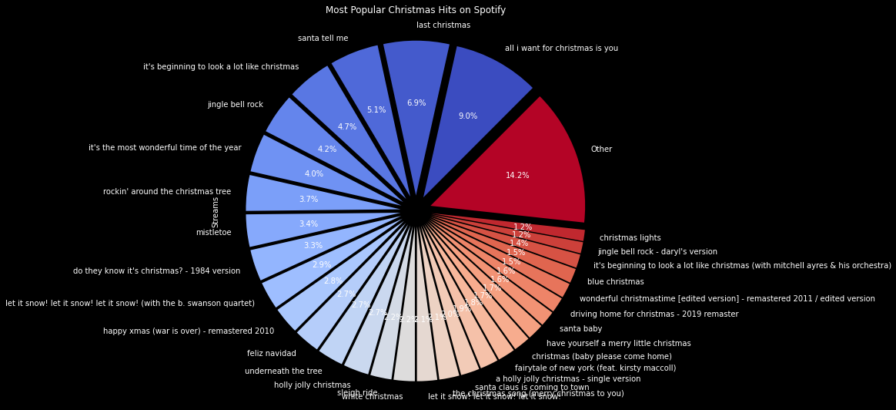
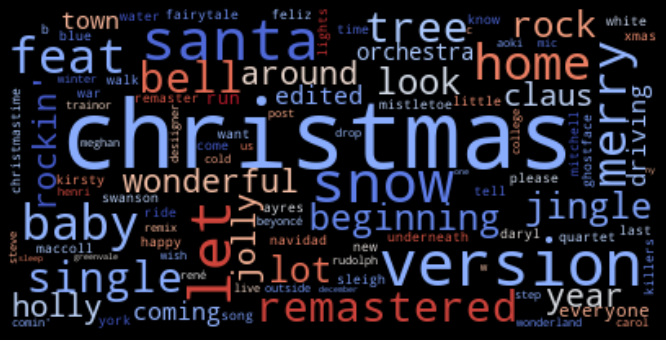
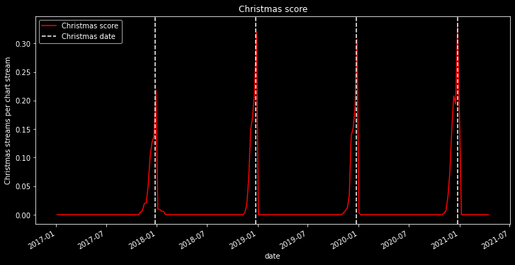
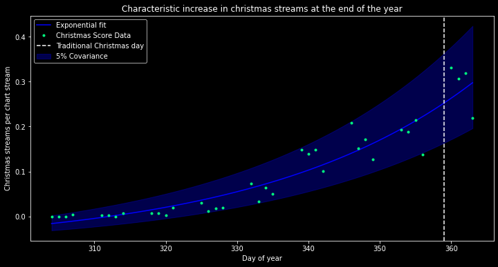

# Predicting Christmas using Data Analysis
Using data analysis and the Spotify Charts API to find a better date for Christmas.

## Usage
1. Open `index.ipynb` in Jupyter Notebook or your local editor.
2. Install `requirements.txt` with `python -m pip install -r requirements.txt`.
3. Run the notebook.

## Disclaimer
Anyone expecting this project to be useful for anything else than entertainment purposes is ~~probably~~ *deifinitely* going to be disappointed.

## Introduction
Throughout the history of humankind, civilizations have used all kinds of methods to keep track of time and created different kinds of calendars, many of them long lost to time. Calendars allow us to arrange meetings, and generally keep track of time in a way that everyone agrees on. Important events or holidays are oftentimes closely connected to the way these calendars are structured and usually celebrated on the same date every year. 

But isn't there a better way? What makes for example the 25th December so special, that we should celebrate Christmas on that day? Why can't we just celebrate Christmas when we feel like it?

## Problem statement

That is the issue I sought out to solve. Finding a better date for Christmas, which isn't determined by arbitrary astronomical periods or historic reasons, but rather by when society _feels_ Christmas should be. 

         Why can't we just celebrate Christmas when we feel like it?

But how can we determine when people feel like Christmas? Is there anything, that is so closely linked to our emotional state, that we can measure?

## The Solution
**Music!** What else reflects human emotions as accurately as art and music? Especially Christmas is characterized by the obnoxious number of Christmas songs that play on loop during the season. Nothing shouts Christmas more than Jingle Bells, Feliz Navidad, and Wham!'s Last Christmas on repeat! 

By analyzing the current charts we should easily be able to determine how christmasie people feel! And using some basic data analysis and mathematical models, we can then extrapolate the ideal Christmas date to celebrate!

## Methods
For the historical analysis, I used Python with the popular data science libraries. The dataset I'm working on is Spotify's historical chart data. 

First I looked for the most frequently played Christmas songs, determined by how often they appear in the charts around Christmas. By using this method, one-hit wonders and songs that just happen to be trending in December are not included (as often). Then I filtered out all the songs that appear in the charts during other times of the year, to eliminate some remaining outliers (since those can't be solid Christmas indicators if they are e.g. trending in August). 

The next step was finding a general way to determine if a song is a Christmas song. For known historic songs that's easy - just look up the song in the list of known Christmas songs, and return one if it has been found. But what about new Christmas hits? To detect those, I created a scoring function, that weights the words used in the track title based on how commonly they appear in the titles of known Christmas songs. This way new songs that might get released, like "snow rock, Christmas tree version" or "Santas jolly baby" will be scored highly, while other songs that aren't Christmas themed will score poorly. 

If we now multiply the songs christmasness scores with their last week's number of streams and set that in relation to the total number of Spotify streams of all songs in that week, we have a "mood score" that will be high, when people feel like Christmas and low during other times of the year. 

By fitting a mathematical function to the historic Christmas mood data, we obtain a model that allows us to predict the following Christmas holidays based on the current charts. 

Plugging in today's (25 Nov 2021) global Spotify charts, the model returns 04 Feb 2022 as recommended date for next Christmas. I personally agree that that would be a much better date for Christmas, instead of next month, giving me enough time to shop for presents sometime in January.

## Comments from the void
Every revolutionary idea will be met with resistance, but I am convinced, that selecting a Christmas date based on when people feel like it instead of a fixed date, would have great benefits for society and is worth pursuing. During the making, I got lots of feedback on the project, some of which have been posted here. 

    I don't know how much time you spent on this, but I know it was too much.  
My colleagues:

    Lol
Friends and family:

    Whoever made this is an idiot. 
    Wait you did? Why???
Someone online:

    Wow, that's useless!

